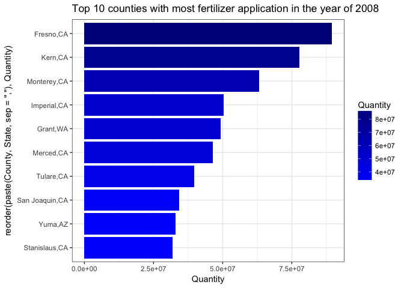
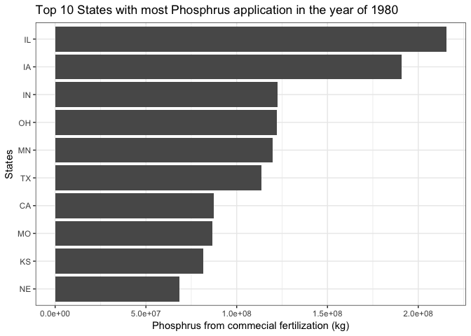
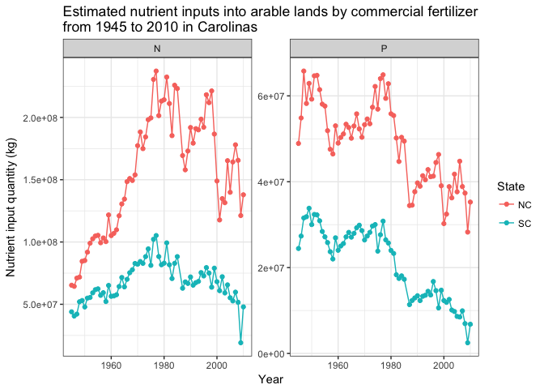

usfertilizer
================

<!--[](https://cran.r-project.org/package=usfertilizer)-->
[]((https://travis-ci.org/wenlong-liu/usfertilizer)) [](https://ci.appveyor.com/project/wenlong-liu/usfertilizer) <!--[](https://cran.r-project.org/package=usfertilizer)
[](https://cran.r-project.org/package=usfertilizer)-->

County-lelel nutrients data from 1945 to 2012
---------------------------------------------

Usfertilizer summarized the estimated county level data from USGS and provided a clean version using Tidyverse.

Please note that USGS does not endorse this package and this package does not include manure data. Also data from 1986 is not available for now.

Installation
------------

Install the stable version via CRAN, just run:

``` r
install.packages("usfertilizer")
```

You can also install the package via my Github Repository.

``` r
# install.package("devtools")   #In case you have not installed it.
devtools::install_github("wenlong-liu/usfertilizer")
```

Get started
-----------

### Import data and related libraries

``` r
require(usfertilizer)
require(tidyverse)
data("us_fertilizer_county")
```

### Summary of the dataset

The dataset, named by us\_fertilizer\_county, contains 582012 observations and 11 variables. Details are available by using `?us_fertilizer_county`.

``` r
glimpse(us_fertilizer_county)
#> Observations: 582,012
#> Variables: 11
#> $ FIPS       <chr> "01001", "01003", "01005", "01007", "01009", "01011...
#> $ State      <chr> "AL", "AL", "AL", "AL", "AL", "AL", "AL", "AL", "AL...
#> $ County     <chr> "Autauga", "Baldwin", "Barbour", "Bibb", "Blount", ...
#> $ ALAND      <dbl> 1539582278, 4117521611, 2291818968, 1612480789, 166...
#> $ AWATER     <dbl> 25775735, 1133190229, 50864716, 9289057, 15157440, ...
#> $ INTPTLAT   <dbl> 32.53638, 30.65922, 31.87067, 33.01589, 33.97745, 3...
#> $ INTPTLONG  <dbl> -86.64449, -87.74607, -85.40546, -87.12715, -86.567...
#> $ Quantity   <dbl> 1580225, 6524369, 2412372, 304592, 1825118, 767573,...
#> $ Year       <chr> "1987", "1987", "1987", "1987", "1987", "1987", "19...
#> $ Fertilizer <chr> "N", "N", "N", "N", "N", "N", "N", "N", "N", "N", "...
#> $ Farm.Type  <chr> "farm", "farm", "farm", "farm", "farm", "farm", "fa...
```

Examples
--------

### Example 1: Find out the top 10 counties with most nitrogen appliation in 2008.

``` r
# plot the top 10 nitrogen application in year 2008.
# Reorder to make the plot more cleanner.
year_plot = 2008
us_fertilizer_county %>%
  filter(Fertilizer == "N" & Year == year_plot) %>%
  top_n(10, Quantity) %>%
  ggplot(aes(x=reorder(paste(County,State, sep = ","), Quantity), Quantity, fill = Quantity))+
  scale_fill_gradient(low = "blue", high = "darkblue")+
  geom_col()+
  ggtitle(paste("Top 10 counties with most fertilizer application in the year of", year_plot)) + 
  scale_y_continuous(name = "Nitrogen from commecial fertilization (kg)")+
  scale_x_discrete(name = "Counties")+
  coord_flip()+
  theme_bw()
```



### Example 2: Find out the top 10 states with most nitrogen appliation in 1980.

``` r
# plot the top 10 states with P application in year 1980.
# Reorder to make the plot more cleanner.
year_plot = 1980
us_fertilizer_county %>%
  filter(Fertilizer == "P" & Year == 1980) %>% 
  group_by(State) %>% 
  summarise(p_application = sum(Quantity)) %>% 
  as.data.frame() %>% 
  top_n(10, p_application) %>%
  ggplot(aes(x=reorder(State, p_application), p_application))+
  scale_fill_gradient(low = "blue", high = "darkblue")+
  geom_col()+
  ggtitle(paste("Top 10 States with most Phosphrus application in the year of", year_plot)) + 
  scale_y_continuous(name = "Phosphrus from commecial fertilization (kg)")+
  scale_x_discrete(name = "States")+
  theme_bw()+
  coord_flip()
```



### Example 3: Plot the N and P input into farms for NC and SC from 1945 to 2010

``` r
year_plot = seq(1945, 2010, 1)
states = c("NC","SC")

us_fertilizer_county %>% 
  filter(State %in% states & Year %in% year_plot &
           Farm.Type == "farm") %>% 
  group_by(State, Year, Fertilizer) %>% 
  summarise(Quantity = sum(Quantity, na.rm = T)) %>% 
  ggplot(aes(x = as.numeric(Year), y = Quantity, color=State)) +
  geom_point() +
  geom_line()+
  scale_x_continuous(name = "Year")+
  scale_y_continuous(name = "Nutrient input quantity (kg)")+
  facet_wrap(~Fertilizer, scales = "free", ncol = 2)+
  ggtitle("Estimated nutrient inputs into arable lands by commercial fertilizer\nfrom 1945 to 2010 in Carolinas")+
  theme_bw()
```



Comments and Questions.
-----------------------

If you have any problems or questions, feel free to open an issue [here](https://github.com/wenlong-liu/usfertilizer/issues).

Lisence
-------

[GPL](https://github.com/wenlong-liu/usfertilizer/blob/master/lisence.txt)

Code of conduct
---------------

Please note that this project is released with a [Contributor Code of Conduct](https://github.com/wenlong-liu/usfertilizer/blob/master/CONDUCT.md). By participating in this project you agree to abide by its terms.
